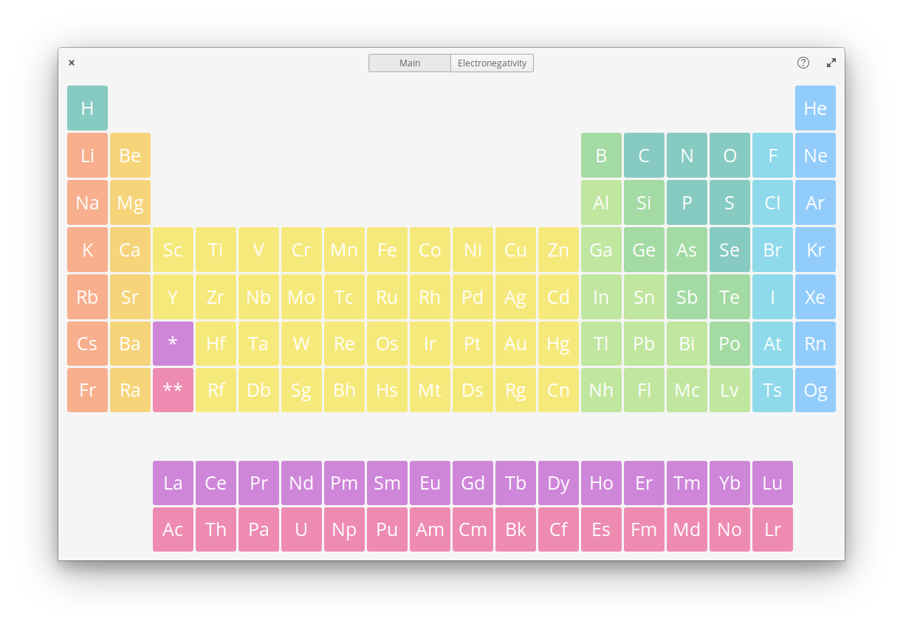

[](https://travis-ci.com/eudaldgr/elements)
<div align="center">
	<span align="center"></span>
	<h1>Elements</h1>
	<h3>A periodic table designed for pantheon shell</h3>
</div>




## Installation

<p align="center">
  <a href="https://appcenter.elementary.io/com.github.eudaldgr.elements"></a>
</p>

### Dependencies

These dependencies must be present before building
 - `valac`
 - `meson`
 - `gtk+-3.0`
 - `granite`
 - `glib2.0`

You can install these on a ubuntu-based system by executing this command:

```
sudo apt install valac libgtk-3-dev libglib2.0-dev libgranite-dev meson
```

### Building

```
git clone https://github.com/eudaldgr/elements.git
meson build && cd build
meson configure -Dprefix=/usr
ninja
sudo ninja install
com.github.eudaldgr.elements
```

### Deconstruct

```
sudo ninja uninstall
```
